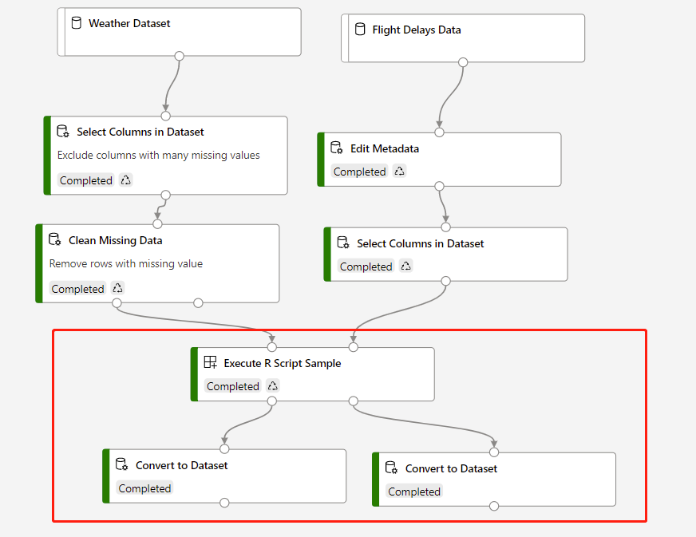

# Custom R component

Custom R component enables user to use custom R script with preferred R version and dependencies.

##  How to use it

The custom R component is similar to the built-in [Execute R Script](https://aka.ms/aml/execute-r-script) 

1. Prepare your R script.

    > **! NOTE:**  
    >
    > Make sure the defined interfaces in yaml and the execution logic in the script are aligned.
    > For example, if you define 3 input parameter in the yaml, make sure your script has deal with the same amount of parameters.

2. Follow [this tutorial](../../tutorial/tutorial1-use-existing-components.md) to register your custom R component.

3. After registering successfully, you can use the use you custom component to process data.
   
   If your custom R component output tabular data and you need to visualize, you need to connect it to [Convert to Dataset](https://aka.ms/aml/convert-to-dataset) module like following screenshot. After submit the pipeline, You can right-click **Convert to Dataset** to visualize the output result.

   

## Known issues

1. Currently the custom R component does not support input dataset of which name contains special characters. You can refer [here](https://mywiki.wooledge.org/BashGuide/SpecialCharacters) for special characters.
